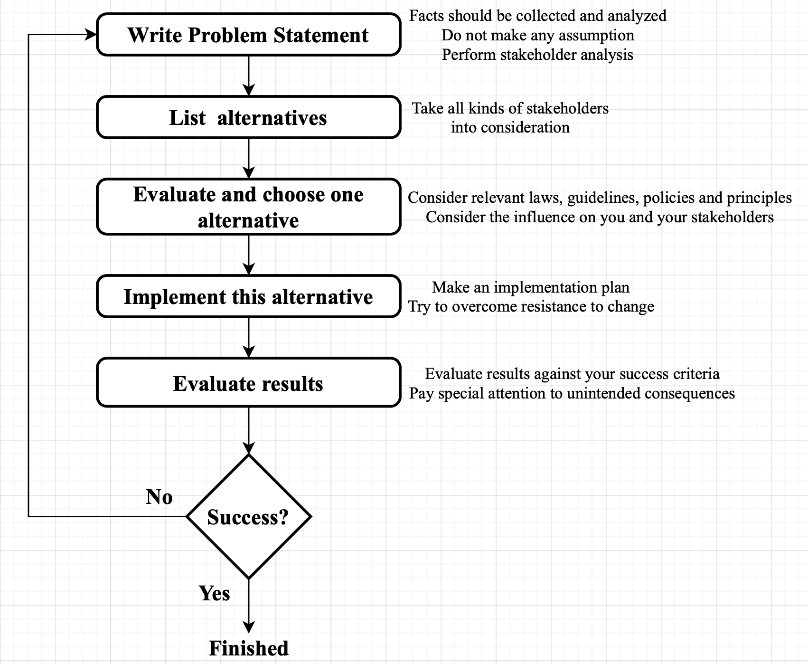

# Group Members

We are group 4 in tutorial 5 of COMP/ENGN 6250.

- Haixu Liu U7215510
- Songyue Chen U7038108
- Tianchi Zhang U7234331
- Wenjia Cheng U7234723
- Zihan Bao U7322593

# Tool 1: Interactive Psychological Test

William John Brinkman and Alton F Sanders introduced many ethical standards from different schools in ethics in a computing culture. For example, consequentialism, act utilitarianism, contractarianism and so on. This interactive psychological test helps you to recognize the moral school that your subconscious is more inclined to. Then it gives you some useful suggestions to help you make more responsible choices.

Now you can go to our [iteractive video](https://www.bilibili.com/video/BV1Dy4y1g7PQ?from=search&seid=10221804769641187826)

# Tool 2: Responsible Decision-making Process (Reference the book "Ethics in Information Technology")

